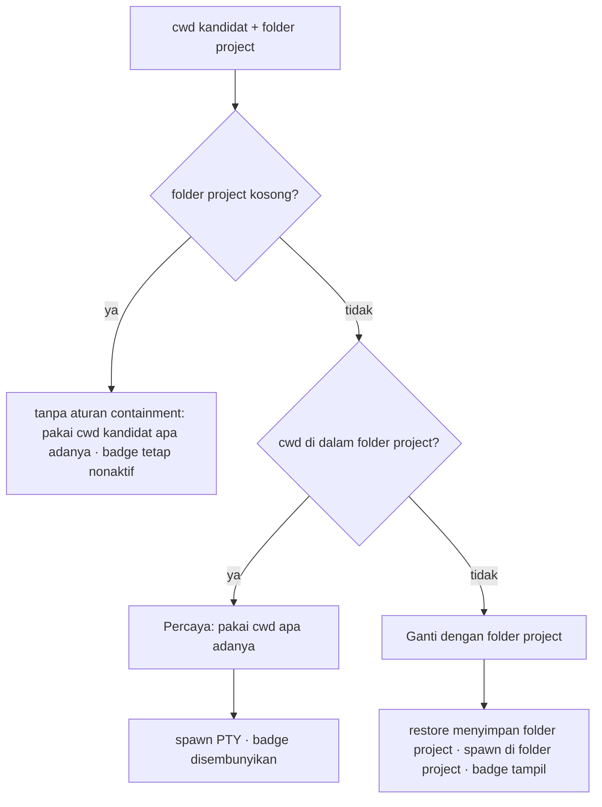

# Terminal cwd containment - Plan

## Goal Capsule

- **Objective:** Setelah aplikasi dibuka lagi, setiap terminal langsung berada di dalam folder project milik workstation-nya; tombol "cd project" hanya tampil ketika terminal berada di luar folder project tersebut.
- **Means:** Satu aturan containment path diterapkan pada tiga titik — restore, spawn PTY, dan deteksi badge (KTD1).
- **Authority:** Requirements menguasai perilaku produk; Key Technical Decisions menguasai mekanisme implementasi; Implementation Units mengutip keduanya tanpa mengulanginya.
- **Stop conditions:** Tanpa perubahan di `src-tauri/` atau skema penyimpanan session; tanpa penambahan test runner; berhenti setelah Verification Contract hijau.
- **Execution profile:** Lightweight — 3 unit, verifikasi smoke manual.
- **Ships:** implementer menutup pekerjaan setelah Definition of Done terpenuhi, termasuk pembersihan kode percobaan sisa.

## Product Contract

### Summary

MyTermin menyimpan cwd tiap terminal dan memakainya ulang saat aplikasi dibuka kembali. Cwd yang tersimpan salah — menunjuk ke home user `C:\Users\USER` — masih dipakai, sehingga terminal terbuka di luar project; dan tombol "cd project" muncul walau terminal sudah berada di sub-direktori project. Rencana ini membatasi kepercayaan pada cwd agar hanya berlaku di dalam folder project.

### Problem Frame

Pengguna menutup MyTermin dan membukanya lagi untuk melanjutkan kerja. Yang terjadi malah terminal terbuka di home user, bukan di folder project, sehingga langkah pertama setiap sesi adalah navigasi manual. Penambal awal hanya menangani cwd yang kosong; cwd yang terisi namun salah melewatinya. Di sisi lain, tombol pemulih "cd project" memakai perbandingan sama-persis, jadi muncul juga ketika terminal berada di sub-direktori yang memang dituju pengguna.

### Key Decisions

- **Cwd terminal hanya dipercaya bila berada di dalam folder project.** (session-settled: user-directed — chosen over menyimpan provenance cwd di storage: satu aturan containment menutup kebocoran cwd salah dan badge sub-direktori sekaligus.) Governs R1, R2, R3.
- **Tombol "cd project" berada di header tiap terminal dan hanya tampil saat cwd di luar folder project.** (session-settled: user-directed — chosen over footer status bar dan menampilkan keduanya: satu titik aksi per pane tanpa menambah elemen di bawah.) Governs R3.

### Requirements

**Kepercayaan cwd**

- R1. Restore session hanya mempertahankan cwd yang berada di dalam folder project workstation; cwd yang kosong atau di luar folder itu dipulihkan ke folder project.
- R2. Spawn PTY selalu memakai cwd yang berada di dalam folder project, termasuk ketika cwd yang diterima kosong atau di luar folder itu.

**Tombol cd project**

- R3. Tombol "cd project" hanya tampil pada header terminal yang cwd-nya berada di luar folder project.

### Acceptance Examples

- AE1. Terminal terakhir tersimpan di `C:\Users\USER`, lalu aplikasi dibuka ulang — terminal terbuka di folder project, bukan di home user.
- AE2. Terminal terakhir tersimpan di sub-direktori folder project — terminal membuka sub-direktori itu dan tombol "cd project" tidak tampil.
- AE3. Dari folder project pengguna mengetik `cd` ke direktori di luar project — tombol "cd project" tampil, dan setelah diklik terminal kembali ke folder project serta tombol hilang.

### Scope Boundaries

**Deferred to Follow-Up Work**

- Verifikasi otomatis hasil spawn lewat `getPtyCwd` beserta koreksi mandiri bila spawn mendarat di luar target.
- Test runner dan skenario otomatis; repo kini tanpa satu pun test, dan sesi ini memilih verifikasi manual.

**Outside this work**

- Perubahan perilaku Rust di `src-tauri/`, perubahan skema penyimpanan session, redesain posisi tombol.

## Planning Contract

### Key Technical Decisions

- KTD1. **Satu helper containment sebagai satu-satunya pemilik aturan.** Helper menormalkan separator ke satu gaya, membuang kutip dan trailing slash, membandingkan tanpa memedulikan huruf besar/kecil, dan hanya menganggap "di dalam" bila path sama dengan root atau diawali root lalu separator — sehingga `D:\MYP\MyTermin2` tidak dianggap di dalam `D:\MYP\MyTermin`. Root kosong berarti tanpa aturan containment: kandidat cwd dipakai apa adanya dan badge tetap nonaktif. Dipulihkan, dispawn, dan dibadge semuanya memanggil helper ini. (session-settled: user-directed — chosen over menyimpan provenance cwd di storage: satu pemilik aturan mencegah drift antar titik penerapan.) Governs R1, R2, R3.
- KTD2. **Penerapan dibatasi ke dua titik baca — restore dan spawn — tanpa menulis ulang storage di tempat lain.** Blok self-healing yang sudah ada di `initFromStorage` dilebaskan dari kondisi "cwd kosong" menjadi "cwd tidak dipercaya"; `updateTerminalCwd` dan kelima ekspresi cadangan `cwd || folderPath` lain tetap apa adanya. Governs R1, R2.

### High-Level Technical Design

Aturan yang sama bercabang di tiga titik pemakaian. Satu keputusan, tiga panggilan:

### Assumptions

- `folderPath` sebuah workstation berisi path absolut Windows yang valid saat restore berjalan.

### Sequencing

U1 lebih dulu karena U2 dan U3 memakai helper yang dibuatnya; U2 dan U3 berjalan paralel setelah U1.

## Implementation Units

### U1. Helper containment dan kondisi badge

- **Goal:** Menjadikan perbandingan "di dalam folder project" sebagai satu implementasi, lalu menempatkannya pada kondisi tampil-tidaknya tombol "cd project".
- **Requirements:** R3.
- **Dependencies:** none.
- **Files:** `app/utils/pathContainment.ts` (baru), `app/components/TerminalPane.vue`.
- **Approach:** 1. Buat helper di `app/utils/pathContainment.ts` sesuai KTD1, mengekspos normalisasi dan uji containment. 2. Hapus `normalizePath` lokal di `TerminalPane.vue` dan pakai helper. 3. Ubah `isCwdMismatch` dari perbandingan sama-persis menjadi uji tidak-di-dalam, mempertahankan guard "project kosong" dan "current kosong" yang sudah ada.
- **Patterns to follow:** Pola prefix pada `app/components/FileTreeNode.vue` dan akar normalisasi pada `app/composables/useProjectExplorer.ts`, diperketat pada batas separator sesuai KTD1.
- **Test scenarios:**
  - cwd = folder project persis — tombol tidak tampil.
  - cwd = sub-direktori folder project (AE2) — tombol tidak tampil.
  - cwd = direktori induk project — tombol tampil.
  - cwd = path yang berbagi awalan teks tetapi bukan anak project — tombol tampil.
  - cwd kosong — tombol tidak tampil, sesuai perilaku sekarang.
  - cwd ditulis dengan huruf kecil atau slash maju — hasilnya sama dengan versi huruf besar dan slash mundur.
- **Verification:** Enam skenario di atas terpenuhi pada pane yang `projectFolder`-nya terisi.

### U2. Restore hanya menyimpan cwd yang dipercaya

- **Goal:** State hasil restore tidak lagi menyimpan cwd yang menunjuk ke luar folder project.
- **Requirements:** R1.
- **Dependencies:** U1.
- **Files:** `app/composables/useWorkspaceStore.ts`.
- **Approach:** Pada loop deduplikasi di `initFromStorage`, ganti kondisi backfill "cwd kosong" menjadi "cwd tidak dipercaya terhadap `ws.folderPath`", tetap dengan guard `ws.folderPath` berisi agar string kosong tidak pernah menimpa cwd. Sisanya — deduplikasi id, fallback `activeTerminalId` — tidak berubah.
- **Patterns to follow:** Blok backfill yang sudah ada di lokasi yang sama.
- **Test scenarios:**
  - cwd tersimpan menunjuk home user (AE1) — setelah restore berisi folder project.
  - cwd tersimpan sub-direktori project (AE2) — tidak diubah.
  - cwd tersimpan kosong — menjadi folder project, perilaku lama dipertahankan.
  - `folderPath` workstation kosong — cwd tidak disentuh.
- **Verification:** Membaca kembali isi `term.cwd` dari storage setelah reload menunjukkan nilai sesuai empat skenario.

### U3. Spawn memakai cwd yang dipercaya

- **Goal:** Proses shell selalu dimulai di dalam folder project tanpa bergantung pada nilai cadangan polos.
- **Requirements:** R2.
- **Dependencies:** U1.
- **Files:** `app/components/TerminalPane.vue`.
- **Approach:** Ganti `spawnCwd = props.cwd || props.projectFolder` pada `initTerminal`, dan `latestCwd` pada `restartTerminalSession`, dengan pemilihan melalui helper yang sama: pakai kandidat cwd bila `projectFolder` terisi dan cwd berada di dalamnya; bila cwd di luar project, ganti dengan `projectFolder`; bila `projectFolder` kosong, helper tidak berlaku dan kandidat cwd dipakai apa adanya. `waitForSessionReady` dan guard unmount yang sudah ada dipertahankan apa adanya.
- **Patterns to follow:** Guard urutan sebelum `createPty` yang sudah ada di `initTerminal`.
- **Test scenarios:**
  - `props.cwd` home user dan `projectFolder` terisi — shell terbuka di folder project (AE1).
  - `props.cwd` kosong dan `projectFolder` terisi — shell terbuka di folder project.
  - `props.cwd` sub-direktori project — shell terbuka di sub-direktori itu (AE2).
  - `projectFolder` kosong dan cwd tersimpan terisi — shell tetap membuka cwd tersimpan, bukan home user.
  - `cd` keluar project lalu shell di-`exit` dan Restart — shell terbuka kembali di folder project.
  - Keduanya kosong — shell tanpa cwd awal, dampaknya dipantau lewat AE1 pada run berikutnya setelah `folderPath` tersedia.
- **Verification:** `cd` keluar project memunculkan tombol (AE3), Restart mengembalikan shell ke folder project, dan membuka ulang aplikasi menutup celah AE1.

## Verification Contract

| Gate | Perintah atau aksi | Berlaku untuk |
|---|---|---|
| Type check | `npx nuxt prepare` bila `.nuxt` belum ada, lalu `npx vue-tsc --noEmit -p .nuxt/tsconfig.json` | U1, U2, U3 |
| Build | `npm run generate` | seluruh plan |
| Smoke perilaku | AE1, AE2, AE3 di aplikasi berjalan | U1, U2, U3 |
| Smoke degraded 1 | Restore lebih lambat dari 3s (log `sessionReady belum siap` muncul di console) — terminal tetap berakhir di folder project, atau fallback ke home terlihat jelas di console | U2, U3 |
| Smoke degraded 2 | Tutup pane/tab selama restore berjalan — tidak ada PTY yatim dan tidak ada pane kosong permanen | U2 |

Repo tidak punya test runner, sehingga seluruh skenario unit dibuktikan lewat smoke manual pada aplikasi berjalan; skenario tetap ditulis eksplisit agar cakupannya tidak menyusut diam-diam.

## Definition of Done

- Type check bersih dan `npm run generate` sukses.
- AE1, AE2, dan AE3 terpenuhi pada aplikasi yang dibangun dari perubahan ini.
- Tidak ada perubahan file di `src-tauri/`.
- Tidak ada kode eksperimen, debug log, atau penyesuaian sisa di diff.
- Per unit: seluruh skenario unit terbukti lewat smoke yang disebut Verification Contract.

## Sources & Research

- `app/components/TerminalPane.vue` — `normalizePath`, `effectiveCwd`, `isCwdMismatch`, `spawnCwd` di `initTerminal`, `restartTerminalSession` dengan `latestCwd`, `waitForSessionReady`, tombol pada sub-header.
- `app/composables/useWorkspaceStore.ts` — blok backfill `initFromStorage`, `updateTerminalCwd`, ekspor `sessionReady`.
- `app/components/LayoutGrid.vue` — `wsFolder` dan binding `:project-folder`.
- `src-tauri/src/pty.rs` — `spawn_pty` memakai `std::env::current_dir()` ketika cwd yang diterima tidak ada, yang menjelaskan jatuhnya ke home user.
- `app/composables/useTauriPty.ts` — `getPtyCwd` dan `createPty`, acuan untuk deferred verifikasi pasca-spawn.
- Pola containment yang sudah dipakai: `app/components/FileTreeNode.vue`, `app/composables/useProjectExplorer.ts`.
