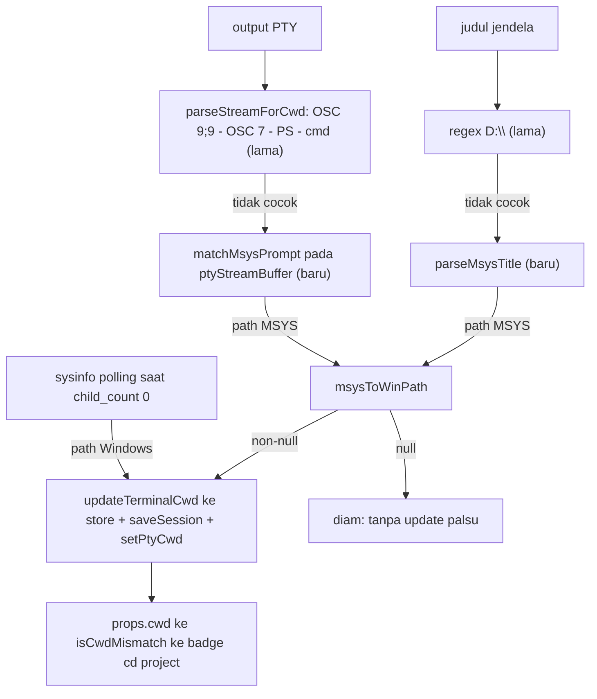
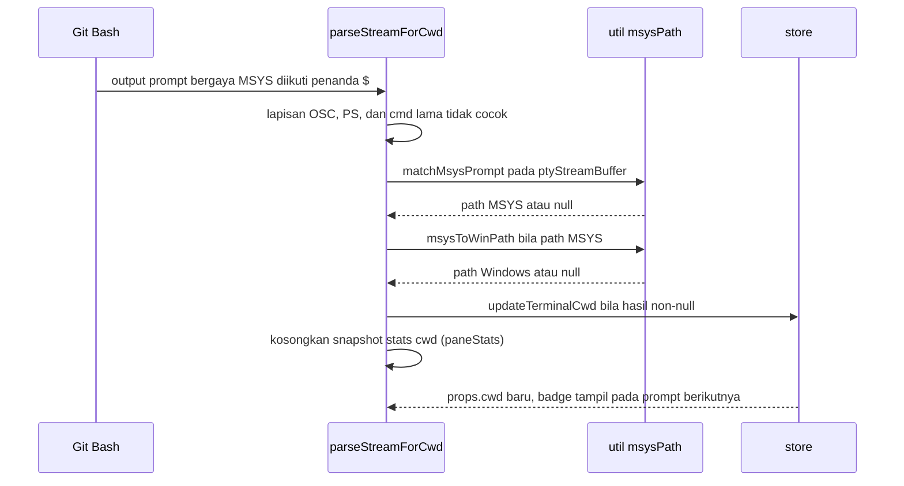

# Git Bash cwd detection - Plan

## Goal Capsule

- **Objective:** Prompt dan judul Git Bash langsung terbaca oleh deteksi cwd MyTermin: setelah `cd` keluar folder project, tombol "cd project" muncul dalam satu siklus prompt — termasuk saat program lama sedang berjalan — dan nilai cwd tetap benar setelah reload.
- **Means:** Util parsing murni MSYS baru di belakang lapisan regex yang sudah ada, dipanggil dari dua titik masuk yang sudah ada (KTD1, KTD2).
- **Authority:** Requirements menguasai perilaku produk; Key Technical Decisions menguasai mekanisme implementasi; Implementation Units mengutip keduanya tanpa mengulanginya.
- **Stop conditions:** Tanpa perubahan di `src-tauri/` atau file rc milik user; tanpa penambahan test runner; berhenti setelah Verification Contract hijau.
- **Execution profile:** Lightweight — 2 unit, verifikasi smoke manual.
- **Ships:** implementer menutup pekerjaan setelah Definition of Done terpenuhi, termasuk pembersihan kode percobaan sisa.

## Product Contract

### Summary

MyTermin memantau output terminal untuk menemukan cwd terbaru dan menampilkan tombol "cd project" ketika terminal berada di luar folder project. Lapisan deteksi yang ada hanya mengenali prompt Windows (PowerShell dan cmd), escape OSC, judul `D:\...`, dan sysinfo; prompt Git Bash yang bergaya MSYS tidak cocok dengan pola mana pun, sehingga deteksi tidak pernah ter-update pada shell ini. Rencana ini menambahkan pengenalan gaya MSYS di belakang pola yang sudah ada.

### Problem Frame

Git Bash sudah lama terdaftar sebagai pilihan shell, tetapi penggunanya tidak memperoleh perilaku yang sudah dinikmati pengguna PowerShell dan cmd: badge "cd project" tidak muncul ketika mereka `cd` keluar project. Setelah perbaikan sysinfo — yang kini diabaikan saat child process aktif — celahnya justru terasa tepat pada kasus yang paling membutuhkannya: program lama berjalan lama setelah navigasi keluar project, dan badge membeku di nilai lama.

### Key Decisions

- **Deteksi dibatasi ke Git Bash (bash.exe), bukan keluarga MSYS2/Cygwin.** (session-settled: user-directed — chosen over deteksi MSYS2 family penuh: satu shell yang sudah terdaftar menutup celah tanpa memperluas parser.) Governs R1, R2.
- **Kriteria setara AE3 penuh ditambah persistensi storage.** (session-settled: user-directed — chosen over deteksi tanpa persistensi: badge tetap benar setelah reload.) Governs R1, R7.
- **Zero-config frontend-only: tanpa perubahan `src-tauri/` dan tanpa menyentuh file rc milik user.** (session-settled: user-directed — chosen over injeksi `PROMPT_COMMAND` saat spawn: lingkungan shell user tidak diubah.) Governs R6.

### Requirements

**Deteksi prompt dan judul**

- R1. Prompt Git Bash terdeteksi dari aliran output PTY dan memanggil `updateTerminalCwd` dalam satu siklus prompt (tanpa menunggu poll 2 detik).
- R2. Judul jendela bergaya MSYS (`user@host MINGW64 /d/path`) terdeteksi lewat `onTitleChange` dan memperbarui cwd melalui jalur yang sama.

**Konversi path MSYS**

- R3. Path MSYS dikonversi ke format Windows: `/d/MYP/MyTermin` → `D:\MYP\MyTermin`; huruf drive case-insensitive dan hasil selalu huruf besar (`/d/` maupun `/D/` → `D:\`); path berspasi tetap utuh; bukan pola `/<drive>/...` → `null`.

**Ketahanan dan kompatibilitas**

- R4. Perilaku cmd/PowerShell tidak berubah: regex lama tetap diurutan pertama, jalur MSYS hanya fallback baru di belakangnya.
- R5. Kegagalan parsing/konversi menghasilkan `null` tanpa memanggil `updateTerminalCwd` (tanpa update palsu); sysinfo tetap fallback terakhir.

**Cakupan dan persistensi**

- R6. Frontend-only: tanpa perubahan kode di luar `app/` (khususnya `src-tauri/`), tanpa menyentuh file rc milik user; file docs/plan bukan bagian dari batasan ini.
- R7. Cwd hasil parse ikut persistensi (`updateTerminalCwd` → `saveSession` + `setPtyCwd`), sehingga benar setelah reload.

### Acceptance Examples

- AE-Gb1. Git Bash: `cd` ke luar folder project → tombol "cd project" muncul dalam satu siklus prompt; klik tombol → shell kembali ke folder project dan tombol hilang.
  - **Covers:** R1, R2
- AE-Gb2. Git Bash: cwd berada di sub-direktori project → tombol "cd project" tidak tampil.
  - **Covers:** R1, R2
- AE-Gb3. Reload aplikasi → badge tetap benar mengikuti cwd tersimpan.
  - **Covers:** R7
- AE-Gb4. Setelah `cd` keluar, program lama dijalankan (child process aktif) → badge tetap mengikuti prompt, tidak membeku di nilai lama.
  - **Covers:** R1

### Scope Boundaries

**Deferred to Follow-Up Work**

- Dukungan shell lain: Cygwin (`/cygdrive/c/...`), zsh, fish, dan generalisasi keluarga MSYS2.
- Test runner dan skenario otomatis; repo kini tanpa satu pun test, dan sesi ini memilih verifikasi manual.

**Outside this work**

- Perubahan `src-tauri/` apa pun; menyentuh `~/.bashrc` / `~/.bash_profile` atau menambah env `PROMPT_COMMAND` saat spawn.
- Custom PS1 (oh-my-bash, tmux, powerline) — mengandalkan sysinfo, terdokumentasi sebagai batasan, bukan bug.
- Perubahan perilaku deteksi cmd/PowerShell yang sudah ada; perubahan UI atau komponen baru.

## Planning Contract

### Key Technical Decisions

- KTD1. **Util murni `app/utils/msysPath.ts` sebagai satu-satunya pemilik konversi dan parsing MSYS.** Util mengekspos konversi path, ekstraksi path dari judul, dan pencarian prompt di buffer stream; kedua titik masuk hanya memanggilnya dan meneruskan hasil non-null ke `updateTerminalCwd`. (session-settled: user-approved — chosen over memasang regex MSYS langsung di TerminalPane: satu util murni dapat diuji ulang tanpa menyentuh komponen.) Governs R3, R5.
- KTD2. **Urutan lapisan deteksi tidak berubah: pola lama tetap di depan, MSYS hanya fallback baru di belakangnya, sysinfo tetap terakhir.** Kedua panggilan baru hanya menempel di cabang "tidak ada kecocokan" yang sudah ada, sehingga cmd/PowerShell dan prioritas OSC tidak bergeser. Governs R4, R5.

### High-Level Technical Design

Tiga sumber deteksi yang sudah ada semuanya mengalir ke satu tujuan; lapisan MSYS hanya menambah dua cabang fallback baru:

Siklus satu prompt pada Git Bash, dari output PTY sampai badge:

### Assumptions

- Prompt default Git Bash berbentuk `user@host MINGW64 /d/path` dan judulnya membawa path bergaya MSYS; keduanya diverifikasi lewat smoke observasi sebelum pola dikunci — bila berbeda, pola disesuaikan ke catatan observasi.
- `updateTerminalCwd` sudah persisten dan lintas-workstation (`saveSession` + `setPtyCwd`), sehingga R7 terpenuhi tanpa perubahan store — lihat KTD2 pada `docs/plans/2026-09-26-1338-fix-terminal-cwd-containment-plan.md`.

### Sequencing

U1 lebih dulu karena U2 memakai ketiga fungsi yang dibuatnya.

## Implementation Units

### U1. Util konversi dan parsing MSYS

- **Goal:** Menjadikan seluruh pengetahuan format MSYS — konversi path, ekstraksi dari judul, pencarian prompt — sebagai satu modul murni yang gagal dengan `null`.
- **Requirements:** R3, R5.
- **Dependencies:** none.
- **Files:** `app/utils/msysPath.ts` (baru).
- **Approach:** Tiga fungsi murni tanpa state sesuai KTD1: `msysToWinPath` mengenali pola `/<drive>/...`, menormalkan ke huruf drive besar dan separator `\`, dan mengembalikan `null` untuk pola lain; `parseMsysTitle` mengambil token path MSYS terakhir dari judul; `matchMsysPrompt` mencari path MSYS di akhir buffer yang diikuti penanda prompt (`$` atau `#`) sebagai jangkar anti-false-positive. Contoh hasil: `/d/MYP/MyTermin` → `D:\MYP\MyTermin`, `/D/x` → `D:\x`, `/d/My Docs/a` → `D:\My Docs\a`.
- **Patterns to follow:** Util auto-import murni `app/utils/pathContainment.ts`.
- **Test scenarios:**
  - Covers R3. `/d/MYP/MyTermin` dikonversi menjadi `D:\MYP\MyTermin`.
  - Covers R3. `/D/x` dan `/d/x` keduanya menghasilkan `D:\x` — huruf drive selalu besar di hasil.
  - Covers R3. `/d/My Docs/MyTermin` menghasilkan `D:\My Docs\MyTermin`, spasi tetap utuh.
  - Covers R3. `/cygdrive/c/x`, `/home/user`, `relative/path`, dan `C:\path` semuanya menghasilkan `null`.
  - Judul `user@host MINGW64 /d/MYP/MyTermin` menghasilkan `/d/MYP/MyTermin`; judul tanpa path MSYS menghasilkan `null`.
  - Buffer prompt Git Bash yang diakhiri `$ ` setelah path MSYS menghasilkan path itu (Covers R1).
  - Path MSYS di tengah output program tanpa penanda prompt di belakangnya menghasilkan `null` (Covers R5).
- **Verification:** Ketiga fungsi mengembalikan hasil yang tepat pada seluruh skenario di atas; kegagalan selalu berupa `null`, tidak pernah string kosong dan tidak pernah exception.

### U2. Dua titik masuk di TerminalPane

- **Goal:** Stream output dan judul jendela memanggil util MSYS pada cabang fallback, sehingga cwd Git Bash ter-update dalam satu siklus prompt.
- **Requirements:** R1, R2, R4, R5, R7.
- **Dependencies:** U1.
- **Files:** `app/components/TerminalPane.vue`.
- **Approach:** 1. Di `parseStreamForCwd`, setelah blok regex PS dan cmd lama tidak menemukan kecocokan, panggil `matchMsysPrompt` pada `ptyStreamBuffer`; hasil non-null diteruskan ke `msysToWinPath` lalu `updateTerminalCwd` — urutan lama tetap di depan sesuai KTD2. 2. Di `onTitleChange`, setelah regex `D:\...` lama tidak cocok, panggil `parseMsysTitle` pada judul dan teruskan hasil konversinya lewat jalur yang sama. 3. Setiap cabang yang menghasilkan `null` diam tanpa memanggil `updateTerminalCwd` (R5). 4. `fetchStats`/sysinfo, `isCwdMismatch`, dan store tidak diubah — persistensi R7 mengikuti `updateTerminalCwd` yang sudah ada. 5. Setelah cabang MSYS memanggil `updateTerminalCwd`, kosongkan snapshot cwd stats (setel `paneStats.cwd` ke string kosong) supaya `effectiveCwd` yang memprioritaskan stats saat idle langsung jatuh ke `props.cwd` baru pada cycle prompt yang sama; tick `fetchStats` berikutnya mengisi ulang snapshot dengan nilai setara dari deteksi sysinfo (R1, AE-Gb1; langkah 4 tetap berlaku).
- **Execution note:** Jalankan Git Bash lebih dulu dan catat prompt serta judul asli apa adanya sebelum mengunci pola; sesuaikan pola bila berbeda dari asumsi di Assumptions.
- **Patterns to follow:** Struktur if-return berlapis di `parseStreamForCwd` dan cabang fallback judul yang sudah ada.
- **Test scenarios:**
  - Covers AE-Gb1. Dari folder project, `cd /d` pada Git Bash → tombol "cd project" muncul pada prompt berikutnya; klik tombol → shell kembali dan tombol hilang.
  - Covers AE-Gb2. Cwd di sub-direktori project → tombol tidak tampil.
  - Covers AE-Gb3. Setelah deteksi berjalan, reload aplikasi → badge tetap benar.
  - Covers AE-Gb4. `cd` keluar lalu jalankan program lama → badge mengikuti prompt berikutnya, tidak membeku di nilai lama.
  - Output program memuat teks mirip prompt MSYS tanpa penanda prompt → tidak ada update cwd (R5).
  - Prompt PowerShell `PS D:\...>`, cmd `D:\...>`, dan judul `D:\...` tetap tertangkap lapisan lama (R4).
  - Git Bash yang `cd` kembali ke folder project → badge nonaktif dalam satu prompt.
- **Verification:** AE-Gb1 sampai AE-Gb4 terpenuhi pada aplikasi berjalan, dan regresi AE1–AE3 (cmd/PowerShell) tetap berjalan seperti sebelumnya.

## Verification Contract

| Gate | Perintah atau aksi | Berlaku untuk |
|---|---|---|
| Type check | `npx nuxt prepare` bila `.nuxt` belum ada, lalu `npx vue-tsc --noEmit -p .nuxt/tsconfig.json` | U1, U2 |
| Build | `npm run generate` | seluruh plan |
| Smoke observasi | Jalankan Git Bash, catat prompt + judul asli apa adanya — pola disesuaikan bila berbeda dari asumsi | U1, U2 |
| AE-Gb1 | Git Bash: `cd` ke luar project → tombol muncul dalam satu siklus prompt; klik → kembali; tombol hilang | U2 |
| AE-Gb2 | Git Bash: cwd di sub-direktori project → tombol tidak tampil | U2 |
| AE-Gb3 | Reload aplikasi → badge tetap benar (persistensi storage) | U2 |
| AE-Gb4 | Setelah `cd` keluar, jalankan program lama (child aktif) → badge tetap mengikuti prompt | U2 |
| Regresi | AE1/AE2/AE3 (cmd/PowerShell) tetap berjalan seperti sebelumnya | U2 |

Repo tidak punya test runner. Skenario unit fungsi murni U1 dibuktikan selama implementasi dengan memanggil ketiga fungsi langsung (Node REPL atau console browser sementara) pada seluruh skenario di U1, lalu menghapus jejak percobaan sebelum diff; skenario perilaku end-to-end (AE-Gb1 sampai AE-Gb4 dan regresi) dibuktikan lewat smoke manual pada aplikasi berjalan. Skenario tetap ditulis eksplisit agar cakupannya tidak menyusut diam-diam.

## Definition of Done

- Type check bersih dan `npm run generate` sukses.
- AE-Gb1 sampai AE-Gb4 terpenuhi pada aplikasi yang dibangun dari perubahan ini; regresi AE1–AE3 tetap hijau.
- Tidak ada perubahan file di `src-tauri/` dan tidak ada perubahan pada file rc milik user.
- Tidak ada kode eksperimen, debug log, atau penyesuaian sisa di diff.
- Per unit: seluruh skenario unit terbukti lewat metode yang disebut Verification Contract.

## Sources & Research

- `app/components/TerminalPane.vue` — `parseStreamForCwd` (lapisan OSC 9;9 → OSC 7 → PS → cmd, `ptyStreamBuffer`), `onTitleChange`, `fetchStats` (sysinfo saat `child_count === 0`), `isCwdMismatch`, dua titik pemanggilan `parseStreamForCwd`.
- `app/composables/useWorkspaceStore.ts` — `updateTerminalCwd` lintas-workstation (KTD2 pada `docs/plans/2026-09-26-1338-fix-terminal-cwd-containment-plan.md`), `saveSession`, `setPtyCwd`.
- `src-tauri/src/main.rs` — Git Bash terdaftar di `get_available_shells`.
- `app/utils/pathContainment.ts` — pola util murni auto-import yang diikuti U1.
- `docs/superpowers/specs/2026-09-26-git-bash-cwd-detection-design.md` — origin: konteks, batasan, dan Verification Contract asli.
